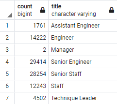
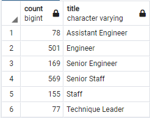
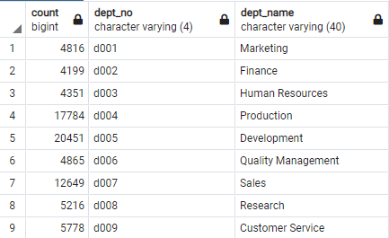
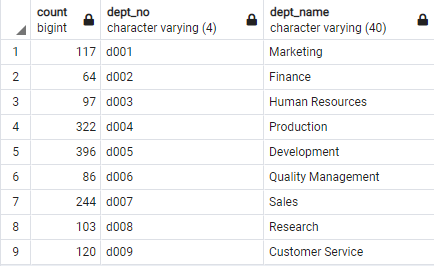

# Pewlett-Hackard-Analysis

## Overview
We use SQL to determine the impact/severity of retirement in a company, as well as the feasibility of a mentorship program as a response to the exodus of retiring employees.

## Results
### Retiring Employees


Above is a table detailing the counts of retiring employees by title, organized by title.

### Eligible Mentors


Above is a table detailing the counts of possible mentors by title, organized by title.  


  * The sum total of the retirees is 90,398.
  * The sum total of the mentors is 1,549.
  * The mentor table is missing a row for managers.
  * The largest group of retirees are Senior Engineers.

## Summary

### Findings
According to the tables generated above, there is a very large difference in the number of those retiring and those eligible for the mentorship program.  Each mentor would have to take, depending on the title, about 20-60 mentees to make up for the numbers lost by retirement (on average, retirees outnumber mentors by about 58 times).

In addition, there seems to be a disparity between the two groups' qualifications.  For example, the missing manager row in the mentor table suggests there are no managers available to mentor new managers, though only two managers are retirement-ready. In another example, we can see that senior engineers compose the largest group of the retirees(over 30% of the total number).  However, only about 10% of the total eligible mentors are senior engineers- a much smaller percentage of an already much smaller number.

For further investigation, I would look at the same issue from the perspective of departments.  It may be that Marketing will be hit much harder by this "silver tsunami" than Sales, for example.

### Further Questions
To explore this question, we establish tables which tally up the retirement-ready employees grouped by department.
```
SELECT COUNT(rt.emp_no),
	d.dept_no,
	d.dept_name
INTO retire_by_dept
FROM retirement_titles as rt
INNER JOIN dept_employees as de
ON (rt.emp_no = de.emp_no)
INNER JOIN departments as d
ON (de.dept_no = d.dept_no)
WHERE (rt.to_date = '9999-01-01')
GROUP BY de.dept_no, d.dept_no
ORDER BY de.dept_no;
```
We then find a similar table for those eligible for this mentorship program.
```
SELECT COUNT(me.emp_no),
	d.dept_no,
	d.dept_name
INTO mentor_by_dept
FROM mentorship_eligibility as me
INNER JOIN dept_employees as de
ON (me.emp_no = de.emp_no)
INNER JOIN departments as d
ON (de.dept_no = d.dept_no)
WHERE (de.to_date = '9999-01-01')
GROUP BY d.dept_no;
```

And our results are as follows:



The above table describes retirement-ready employees, grouped by department.



The above table describes eligible mentors, grouped by department.

In these tables, we can see a familiar, large disparity in size.  However, it does not seem any one department is significantly more at risk than any other in the face of this "silver tsunami".
